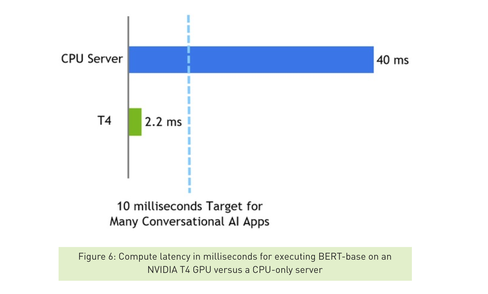
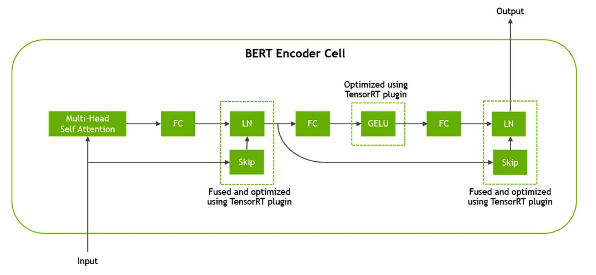
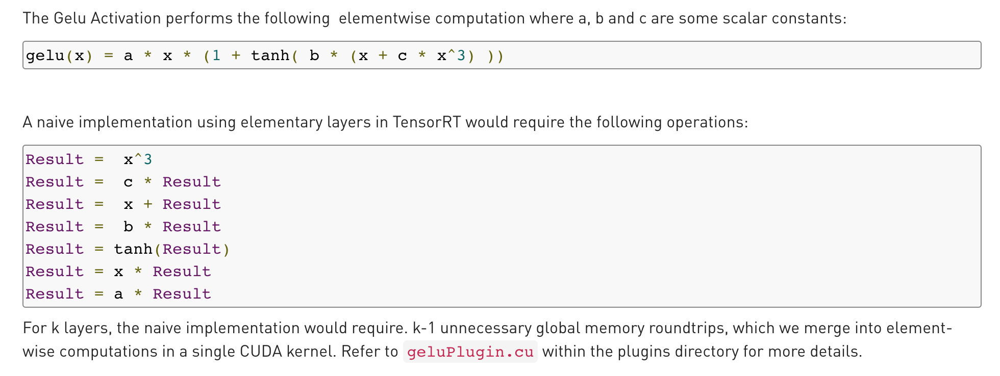
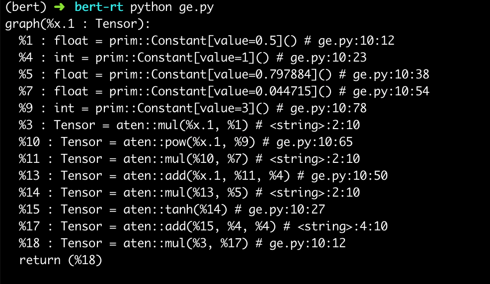
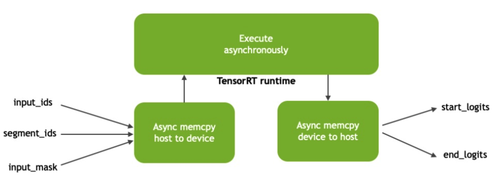

# BERT Runtime

最近继续怼[BERT](https://arxiv.org/abs/1810.04805)，项目大部分模型都上了BERT，真香啊。

本来一直在使用`PyTorch JIT`来解决加速和部署的问题，顺手还写了个[service-streamer](https://github.com/ShannonAI/service-streamer)来做web和模型的中间件。
正好上个月NVIDIA开源了基于`tensorrt`的BERT代码，[blog](https://devblogs.nvidia.com/nlu-with-tensorrt-bert/)号称单次`inference`只用2.2ms，比cpu快20倍。但是正确的问法是：这东西能比`tf/pytorch`快多少呢？

于是从TensorRT开始，认真学习了一波NVIDIA的BERT实现。并做了下性能Benchmark对比TensorFlow和PyTorch，结论是gpu时间能快15%-30%。主要归因于对BERT的计算图优化，自己实现了4个cuda kernel，另外避免了TensorFlow和PyTorch等框架带来的overhead。

## Prerequisite

比较有用的几个背景知识：

1. 当然是BERT的[Paper](https://arxiv.org/abs/1810.04805)，[Tensorflow实现](https://github.com/google-research/bert)，[PyTorch实现](https://github.com/huggingface/pytorch-transformers)
1. Harvard写的著名解读[The Annotated Transformer](http://nlp.seas.harvard.edu/2018/04/03/attention.html)
1. GPU和Cuda基础知识，很简单可以参考我的[cuda101](https://github.com/Meteorix/meteorix-blog/blob/master/_posts/cuda101.md)

## TensorRT

跟[TensorRT](https://github.com/NVIDIA/TensorRT)的编译斗争了一两天，整体还是比较顺畅，照着README：

1. 准备环境，常规c++/py编译环境和cuda环境，我是`Titan XP + cuda-10.0 + cuDNN-7.4`
1. 下载TensorRT的binary release。TensorRT本身并没有开源，而是提供了编译好的lib。开源的周边代码包括：
    * `include`头文件
    * `plugin`实现一些cuda扩展
    * `parser`实现不同格式模型文件的解析
1. Docker build编译用的镜像。
1. 在Docker容器里面编译TensorRT的lib和开源代码。

## TensorRT BERT

TensorRT的BERT实现代码在[demo/BERT](https://github.com/NVIDIA/TensorRT/tree/release/5.1/demo/BERT)目录下，主要提供了：
1. 针对BERT进行了4个计算图优化，用cuda实现了几个fusion的kernel，封装成TensorRT的plugin
1. TensorFlow模型文件转TensorRT模型文件的脚本
1. C++和python版API和完整的BERT inference代码。

还是看README，以`SQuAD(QA)`模型为例提供了完整的使用步骤：
1. 下载BERT在SQuAD上finetune的TF模型文件，或者你也可以用自己finetune的模型文件
1. 使用转换脚本将TF模型文件转换成TensorRT模型文件
1. 使用另一个脚本将模型、参数、输入问题转换为Tensor形式的输入输出
1. 编译C++可执行文件，即可测试加速后的模型和输入输出，并保存为`bert.engine`

这个`bert.engine`文件，就可以单独使用了。既可以用C++ API或Python API加载后使用，也可以使用TensorRT Serving的docker直接加载做service。

### Python API

当然PythonAPI更好用，所以

### 复现NVIDIA提供的性能数据

NVIDIA官方数据是在`batchsize=1，seqlen=128`时测试的。在我们的Titan XP上分别使用C++和Python API，GPU时间都在`2.6ms`左右，基本复现了官方数据。



比较有意思的是，明明与pytorch和tensorflow等框架比更能说明bert优化的效果，可能是为了diss cpu好卖gpu卡吧 :P

下面我们就来正经做一下Benchmark

## Benchmark

对于BERT的inference，很大一部分时间消耗在预处理上，即将输入的文字``tokenize``为`index`，执行`padding`和`masking`，再组装成`tensor`。而我们这里的benchmark只关心GPU执行inference的性能。所以我们的计时代码只包含GPU时间，也就是tensor输入到输出的时间，排除掉前后处理时间，另外包含tensor在CPU和GPU之间copy的时间。

### 环境

**GPU版本**
* GPU Titan XP
* Cuda 10.0
* Cudnn 7.5

**Python3.6版本**
* Torch==1.2.0
* TensorFlow==1.14.0
* tensorrt==5.1.5.0

**BERT实现**
* tensorrt基于 https://github.com/NVIDIA/TensorRT/tree/release/5.1/demo/BERT
* TensorFlow基于 https://github.com/google-research/bert
* PyTorch基于 https://github.com/huggingface/pytorch-transformers

**模型**
* bert-base 12层，SQuQA finetuned
* 相同的模型参数，分别转换为tensorrt/tf/pytorch模型文件

### SQuAD任务

使用SQuAD(QA)任务进行测试
```
# 输入文章和问题
Passage: TensorRT is a high performance deep learning inference platform that delivers low latency and high throughput for apps such as recommenders, speech and image/video on NVIDIA GPUs. It includes parsers to import models, and plugins to support novel ops and layers before applying optimizations for inference. Today NVIDIA is open sourcing parsers and plugins in TensorRT so that the deep learning community can customize and extend these components to take advantage of powerful TensorRT optimizations for your apps.

Question: What is TensorRT?

# 输出答案
Answer: 'a high performance deep learning inference platform'
```

使用上面的QA任务样例，输入`padding`到`Sequence Length=328`，`Batch Size`分别使用`1`和`32`。测量100次取平均单句时间，单位是`ms`

|bs * seqlen|tensorrt c++|tensorrt py|tensorflow|pytorch|pytorch jit|
|-|-|-|-|-|-|
|1 * 328|9.9|9.9|17|16.3|14.8|
|32 * 328|7.3| |11.6|9.9|8.6|

注：
1. TensorFlow接口封装不太熟悉，仅供参考，目测与PyTorch无jit版本性能差不多
2. TensorRT py接口暂时没实现多batch的inference，目测与c++版本性能差不多
3. 所有测试GPU利用率都接近`100%`，说明没有什么GPU之外的阻塞代码

结论：
1. TensorRT比PyTorch快39%-26% 
2. TensorRT比PyTorch jit快33%-16%

## 计算图优化和kernel优化

那么我们来看看TensorRT实现的BERT，到底做了哪些优化。



上面的计算图给了一个BERT `Transformer Encoder`的总览。对``Transformer``还不熟悉的话，可以回头看看Harvard写的著名解读[The Annotated Transformer](http://nlp.seas.harvard.edu/2018/04/03/attention.html)。总共有4点计算图优化，3点在`Transformer`中：
1. `gelu`激活函数的kernel实现
2. `residual`和`layernorm`函数的fusion
3. `Q/K/V`三个矩阵的合并乘法和转置

上面的前3个优化在12层``Transformer``中都会用到，所以性价比很高。第4点优化在最底层`BERT Embedding`层：

4. `embedding`和`layernorm`的fusion

下面分别看看4处优化是如何实现的，我也是趁此机会了解计算图优化和cuda kernel函数的编写。

### gelu

按照`gelu`的公式，如果每步分开计算，每步kernel调用都会进行一次global显存的读写。



> 由于gpu的硬件特性，`global memory`的访问速度非常慢（相对计算而言），这里可以参考前一篇笔记中的[gpu设计和内存结构](https://github.com/Meteorix/meteorix-blog/blob/master/_posts/cuda101.md#gpu%E8%AE%BE%E8%AE%A1)。

于是TensorRT就写一个gelu的kernel，一次kernel函数调用解决问题，只用一次显存读写。

https://github.com/NVIDIA/TensorRT/blob/release/5.1/demo/BERT/plugins/geluPlugin.cu

```cpp
// constants for approximating the normal cdf
constexpr float A = 0.5;

constexpr float B = 0.7978845608028654; // sqrt(2.0/M_PI)

constexpr float C = 0.035677408136300125; // 0.044715 * sqrt(2.0/M_PI)

template <typename T, unsigned TPB>
__global__ void geluKernel(const T a, const T b, const T c, int n, const T* input, T* output)
{

    const int idx = blockIdx.x * TPB + threadIdx.x;

    if (idx < n)
    {
        const T in = input[idx];
        const T cdf = a + a * tanh(in * (c * in * in + b));
        output[idx] = in * cdf;
    }
}
```

对比PyTorch JIT

```
@torch.jit.script
def gelu(x):
    return 0.5 * x * (1 + torch.tanh(0.797884 * (x + 0.044715 * torch.pow(x, 3))))

print(gelu.graph)
```



从计算图上看确实每一步是单独计算，除了`tanh`这种内置的函数，其他都要一层层函数调用。

不过，在PyTorch 1.2的最新代码中，我发现`gelu`也是用了内置的cuda实现，两者几乎等价。

### Residual and Layer-Normalization


### QKV 优化


### 异步执行

TensorRT的blog特别提了一下异步执行。由于CPU和GPU是异构的，在CPU和GPU之间copy tensor、GPU runtime执行计算都是异步完成的。不强制同步可以增加整个流程的吞吐量`througput`。Profile的时候需要特别注意这个异步的时间。这点在TensorRT的python代码中也能看到，实现的非常仔细。



PyTorch实际上也是异步的，所以这点TensorRT没什么优势


## Next Steps


